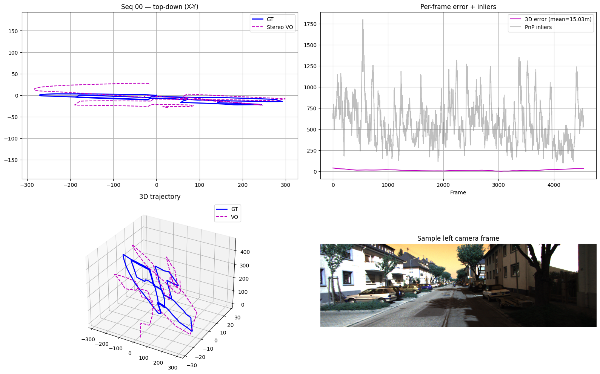
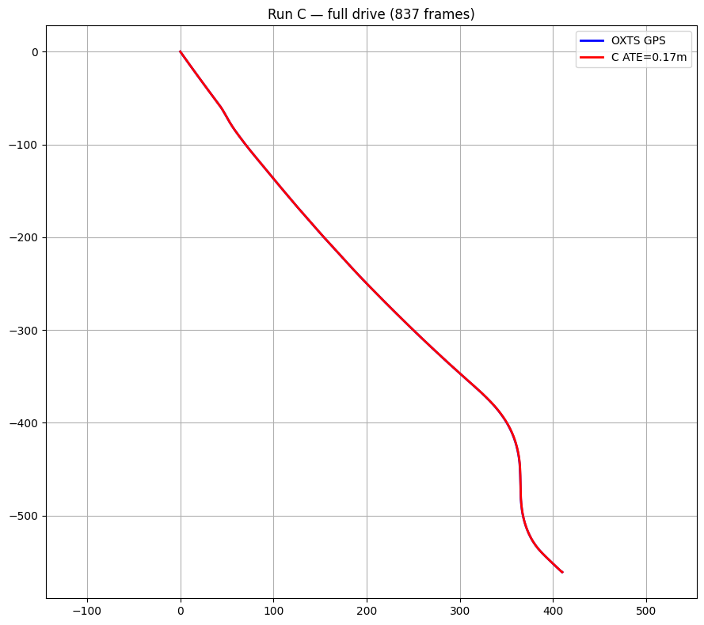
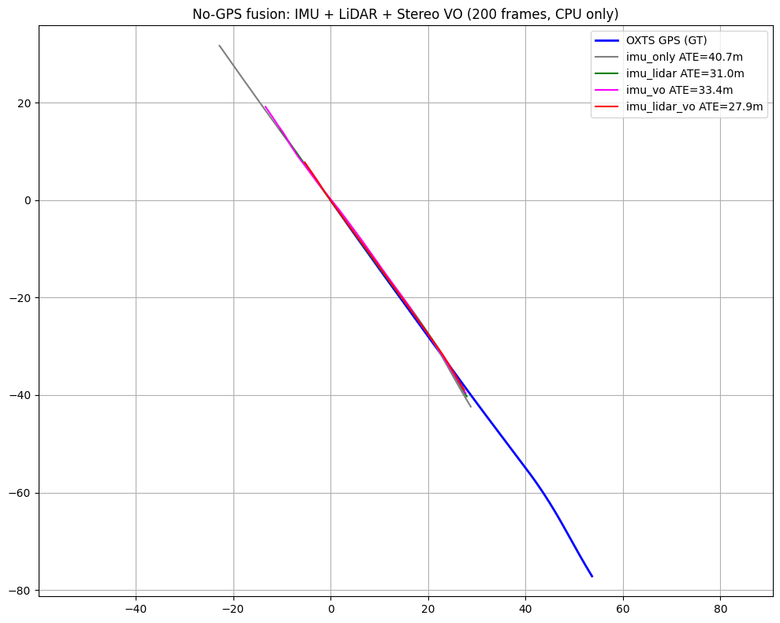
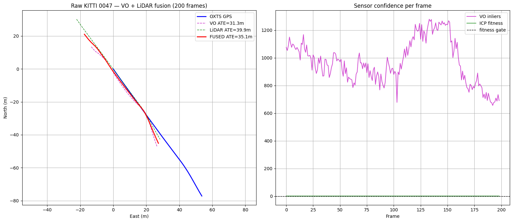

# KITTI Multi-Track Sensor Fusion

Modular pose-estimation benchmarks on KITTI-family datasets: **GPS-aided fusion**, **stereo visual odometry**, and **4-sensor ablation** on raw synced logs.

> **Portfolio entry point:** pick a track below — each uses a different dataset and evaluation reference.

---

## Choose a Track

| | **Track A — Ianvs** | **Track B — Stereo VO** | **Track C — Raw 0047** |
|:---:|:---:|:---:|:---:|
| **Folder** | `src/` | `tracks/track_b_odometry_vo/` | `tracks/track_c_raw_0047/` |
| **Sensors** | GPS + IMU + LiDAR | Camera (stereo) | GPS + IMU + LiDAR + Camera |
| **GPS in filter?** | Yes | No | Aided: Yes · Odom: No |
| **Ground truth** | OXTS INS/GNSS | `poses/XX.txt` | OXTS (eval / aided updates) |
| **Core algorithms** | GICP + Umeyama + 2D EKF | ORB + triangulation + PnP | EKF (aided) · ICP + VO fusion (odom) |
| **Highlight result** | ~1–6 m ATE (multi-drive) | ~15–17 m ATE (seq 00) | 0.17 m aided · ~28 m odom |

---

## Results at a Glance

| Track | Mode | Frames | ATE | Length err | Notes |
|-------|------|-------:|----:|-----------:|-------|
| **A** | GPS+IMU+LiDAR EKF | 108 (drive 0001) | ~1.1 m | ~2.5% | Short urban segment |
| **A** | Multi-drive mean | 9 drives | ~6 m | ~3–18% | Drive 0014 worst (~38 m ATE) |
| **B** | Stereo VO only | 4540 (seq 00) | ~15–17 m | ~1.5% | Official pose GT; camera only |
| **C** | GPS+IMU EKF (aided) | 837 | ~0.17 m | ~0% | GPS-aided navigation |
| **C** | LiDAR+VO odom (no GPS) | 200 | ~28 m | varies | Open-loop odometry |

> **Honest labeling:** Tracks A and C (aided) use OXTS as both sensor input and reference. Track B uses independent camera pose GT. Track C (odom) uses OXTS for evaluation only.

---

# Track A — Ianvs GPS + IMU + LiDAR (Stable 2D + Experimental 3D)

2D pose estimation by fusing **Velodyne scan-matching odometry**, **OXTS GPS**, and **IMU-related OXTS signals** with an **Extended Kalman Filter (EKF)**, evaluated on the **[KubeEdge-Ianvs KITTI Pose Estimation Dataset](https://www.kaggle.com/datasets/kubeedgeianvs/the-kitti-pose-estimation-dataset)**.

---

## Repository Versions (Track A)

This track contains two implementations:

### Stable 2D Pipeline

- 2D vehicle pose estimation
- State: `[x, y, yaw, velocity]`
- Generalized ICP (GICP)
- GPS + IMU + LiDAR EKF
- Multi-drive evaluation

### Experimental 3D Pipeline

An extension of the project that estimates full 3D trajectories using LiDAR, GPS, and IMU.

Features include:

- 3D LiDAR odometry
- 3D GPS alignment
- 3D Extended Kalman Filter
- Height profile evaluation
- 3D trajectory visualization

The 3D implementation is intended for experimentation and comparison with the stable 2D pipeline.

---

## Track A — Overview

This repository implements a complete sensor fusion pipeline that combines:

- **LiDAR odometry** from Generalized ICP (GICP)
- **GPS position** from KITTI OXTS packets
- **IMU motion** (forward acceleration and yaw rate)
- **Extended Kalman Filter** state estimation

The final system estimates a robust **2D vehicle pose**:

```
[x, y, yaw, velocity]
```

---

## Track A — Features

This track contains the **final upgraded pipeline** only.

### LiDAR Odometry

- Generalized ICP (GICP)
- Range filtering
- RANSAC ground removal
- Voxel grid downsampling
- IMU-aided ICP initialization
- ICP fitness and RMSE rejection

### Alignment

- Global Umeyama alignment
- LiDAR trajectory aligned into GPS frame

### Sensor Fusion (EKF)

**State:**

```
[x, y, yaw, v]
```

**Measurements:**

- GPS position
- Adaptive LiDAR position
- GPS-derived speed
- OXTS yaw

**Prediction:**

- IMU forward acceleration
- IMU yaw rate

### Execution Modes

- Single drive
- Multi-drive benchmark (`--all`)

---

## Track A — Pipeline

```
             OXTS
      (GPS + IMU signals)
              │
              ▼
      Local UTM Coordinates
              │
              ▼
        GPS / Speed / Yaw
              │
              ▼
        Extended Kalman Filter
              ▲
              │
Velodyne scans (.bin)
        │
        ▼
 Preprocessing
  • Range filter
  • Ground removal
  • Downsampling
        │
        ▼
       GICP
        │
        ▼
 Umeyama Alignment
        │
        ▼
  LiDAR Position
```

---

## Track A — Dataset

Download the dataset from Kaggle:

> https://www.kaggle.com/datasets/kubeedgeianvs/the-kitti-pose-estimation-dataset

Directory layout:

```
data/
└── 2011_09_26/
    ├── 2011_09_26_drive_0001_sync/
    │   ├── oxts/
    │   │   └── data/
    │   └── velodyne_points/
    │       └── data/
    ├── 2011_09_26_drive_0002_sync/
    └── ...
```

> **Important:** Do **not** commit dataset files to the repository.

### Dataset License (Track A)

The dataset follows:

- **CC BY-NC-SA 3.0 IGO**
- KITTI Dataset License

Please cite both KITTI and the KubeEdge-Ianvs curated dataset.

---

## Track A — Usage

### Set dataset path

Linux/macOS:

```bash
export DATA_ROOT=/path/to/data/2011_09_26
```

Windows:

```bat
set DATA_ROOT=C:\path\to\data\2011_09_26
```

### Run a single drive

Default: `2011_09_26_drive_0001_sync`

```bash
python -m src.run --drive 2011_09_26_drive_0001_sync
```

Outputs:

```
outputs/
├── fused_state.csv
└── sensor_fusion_result.png
```

### Run all drives

```bash
python -m src.run --all
```

Generated outputs:

```
outputs/
├── all_drives_trajectories.png
├── all_drives_errors.png
├── all_drives_icp.png
├── performance_summary.png
└── velocity_yaw_profile.png
```

A performance summary is also printed to the console.

### Running Track A on Kaggle

1. Add the **KubeEdge-Ianvs KITTI Pose Estimation Dataset**
2. Set:

```python
DATA_ROOT = "/kaggle/input/datasets/kubeedgeianvs/the-kitti-pose-estimation-dataset/data/2011_09_26"
```

3. Run the notebook or `python -m src.run --all`

The notebook mirrors the implementation inside `src/`.

---

## Track A — Configuration

Main parameters are located in:

```
src/config.py
```

or

```
src/pipeline.py
```

| Parameter | Typical Value | Description |
|-----------|--------------:|-------------|
| `ICP_FITNESS_THRESHOLD` | 0.30 | Reject poor GICP registrations |
| `ICP_RMSE_THRESHOLD` | 0.50 | Reject high registration error |
| `VOXEL_SIZE` | 0.40 m | Point cloud downsampling |
| `RANGE_LIMIT` | 60 m | LiDAR range filter |
| `Q_*` | tuned | EKF process noise |
| `R_*` | tuned | EKF measurement noise |
| `LIDAR_NOISE_*` | tuned | Adaptive LiDAR covariance |

---

## Track A — Example Results

Evaluation uses OXTS GPS XY as the reference trajectory.

| Drive | Frames | Length Error | Notes |
|-------|-------:|-------------:|-------|
| 0001 | 108 | ~2–3% | Short urban segment |
| 0011 | 233 | ~3.3% | Good performance |
| 0014 | 314 | ~15–18% | Long loop; ICP drift dominates |
| 0017 | 114 | N/A | Very short trajectory (~0.1 m); use ATE instead |

Results vary slightly depending on:

- Open3D version
- ICP tuning
- EKF noise parameters

---

## Track A — Result Visualizations

The pipeline automatically generates summary plots under the `outputs/` directory after running the multi-drive benchmark.

### Performance Summary Across All Drives


### Trajectory Error Across All Drives


### ICP Fitness per Drive


### Per-frame Position Error vs GPS


### Velocity Profile


---

## Track A — Experimental 3D Pipeline Results

The experimental 3D pipeline estimates vehicle motion in all three spatial dimensions and provides additional evaluation plots for vertical motion and 3D position accuracy.

### 3D Position Error vs OXTS


### Vertical Channel Comparison


---

# Track B — KITTI Odometry Stereo Visual Odometry

**Camera-only** visual odometry on the **[KITTI Odometry dataset](https://www.kaggle.com/datasets/hocop1/kitti-odometry)** (`image_2` + `image_3` + `calib.txt`).

Ground truth from **`poses/XX.txt`** is used for **evaluation only** — not fused into the estimator.

---

## Track B — Algorithms

- **ORB** feature detection and descriptor matching
- **Stereo triangulation** (`cv2.triangulatePoints`)
- **PnP RANSAC** for frame-to-frame motion
- **Umeyama 3D** alignment for ATE vs official poses

---

## Track B — Dataset Layout

```
kitti-odometry/
├── poses/
│   └── 00.txt
└── sequences/
    └── 00/
        ├── image_2/
        ├── image_3/
        ├── velodyne/
        └── calib.txt
```

Sequences **00–10** have public pose ground truth.

---

## Track B — Usage

Linux/macOS:

```bash
export ODOMETRY_DATA_ROOT=/path/to/kitti-odometry
```

Windows:

```bat
set ODOMETRY_DATA_ROOT=C:\path\to\kitti-odometry
```

Run stereo VO on sequence 00:

```bash
python -m tracks.track_b_odometry_vo.run --seq 00
```

Quick test (500 frames):

```bash
python -m tracks.track_b_odometry_vo.run --seq 00 --max-frames 500
```

Outputs:

```
outputs/track_b/
├── vo_seq00.csv
└── stereo_vo_seq00.png
```

---

## Track B — Example Results (seq 00)

| Metric | Value |
|--------|------:|
| ATE 3D (aligned) | ~15–17 m |
| Final 3D error | ~32 m |
| Path length error | ~1.5% |
| Failed frames | 0 / 4540 |
| Mean PnP inliers | ~580 |

---

## Track B — Visualization



---

# Track C — Raw KITTI `2011_10_03_drive_0047` (4-Sensor)

Fully synchronized **837-frame** raw KITTI log with **OXTS, Velodyne, stereo camera, and calibration**.

---

## Track C — Modes

| Mode | Command | Sensors in estimator | Purpose |
|------|---------|----------------------|---------|
| **aided** | `--mode aided` | GPS + IMU (OXTS) | GPS-aided navigation |
| **odom** | `--mode odom` | LiDAR + Camera | GPS-denied odometry |

---

## Track C — Algorithms

**aided mode**

- WGS84 → local coordinates (`pyproj`)
- **2D EKF** `[x, y, yaw, v]`
- IMU predict + GPS / speed / yaw updates

**odom mode**

- **SciPy ICP** LiDAR odometry
- **Stereo VO** (ORB + triangulation + PnP)
- **Weighted relative-pose fusion** (LiDAR + VO)
- **Umeyama 3D** alignment for evaluation vs OXTS only

---

## Track C — Dataset Layout

```
2011_10_03/
├── calib_cam_to_cam.txt
├── calib_imu_to_velo.txt
├── calib_velo_to_cam.txt
└── 2011_10_03_drive_0047_sync/
    ├── oxts/data/
    ├── velodyne_points/data/
    ├── image_02/data/
    └── image_03/data/
```

Download from [KITTI raw data](http://www.cvlibs.net/datasets/kitti/raw_data.php).

> **Important:** Do **not** commit dataset files to the repository.

---

## Track C — Usage

Linux/macOS:

```bash
export RAW_DATA_PATH=/path/to/2011_10_03/2011_10_03_drive_0047_sync
export RAW_CALIB_ROOT=/path/to/2011_10_03
```

Windows:

```bat
set RAW_DATA_PATH=C:\path\to\2011_10_03\2011_10_03_drive_0047_sync
set RAW_CALIB_ROOT=C:\path\to\2011_10_03
```

GPS-aided EKF:

```bash
python -m tracks.track_c_raw_0047.run --mode aided
python -m tracks.track_c_raw_0047.run --mode aided --max-frames 837
```

GPS-denied LiDAR + VO odometry:

```bash
python -m tracks.track_c_raw_0047.run --mode odom --max-frames 200
python -m tracks.track_c_raw_0047.run --mode odom
```

Outputs:

```
outputs/track_c/
├── aided_trajectory.csv
├── aided_trajectory.png
├── odom_trajectory.csv
└── odom_trajectory.png
```

### Running Track C on Kaggle

```python
RAW_DATA_PATH = "/kaggle/working/2011_10_03/2011_10_03_drive_0047_sync"
RAW_CALIB_ROOT = "/kaggle/working/2011_10_03"
```

---

## Track C — Example Results

| Mode | Frames | ATE 2D | Length err | Notes |
|------|-------:|-------:|-----------:|-------|
| aided | 837 | ~0.17 m | ~0% | GPS+IMU EKF |
| aided | 200 | ~0.10 m | ~0.1% | Quick test |
| odom | 200 | ~28 m | varies | No GPS in filter |

---

## Track C — Visualizations (from notebook)

### GPS-aided EKF — full 837 frames (Cell 16, Run C)



### GPS-denied IMU + LiDAR + Stereo VO (Cell 20)



### Optional — open-loop VO + LiDAR baseline (Cell 13, auto-saved)


---

# Installation

Create a virtual environment:

```bash
python -m venv .venv
```

Activate it:

Linux/macOS:

```bash
source .venv/bin/activate
```

Windows:

```bat
.venv\Scripts\activate
```

Install dependencies:

```bash
pip install -r requirements.txt
```

**Main dependencies:** NumPy, Matplotlib, pyproj, Open3D, OpenCV, SciPy, tqdm

---

# Project Structure

```
.
├── README.md
├── CHANGELOG.md
├── LICENSE
├── requirements.txt
├── .gitignore
├── src/
│   ├── __init__.py
│   ├── config.py
│   ├── loaders.py
│   ├── icp.py
│   ├── alignment.py
│   ├── ekf.py
│   ├── pipeline.py
│   └── run.py
├── shared/
│   ├── __init__.py
│   └── metrics.py
├── tracks/
│   ├── __init__.py
│   ├── track_b_odometry_vo/
│   │   ├── __init__.py
│   │   ├── config.py
│   │   ├── loaders.py
│   │   ├── stereo_vo.py
│   │   ├── pipeline.py
│   │   └── run.py
│   └── track_c_raw_0047/
│       ├── __init__.py
│       ├── config.py
│       ├── loaders.py
│       ├── icp.py
│       ├── stereo_vo.py
│       ├── ekf.py
│       ├── odom_pipeline.py
│       ├── pipeline.py
│       └── run.py
├── notebooks/
│   └── kitti_sensor_fusion.ipynb
└── outputs/
    ├── Performance Summary Across All Drives.png
    ├── All drives error.png
    ├── ICP Fitness per Drive.png
    ├── per_frame position error vs GPS.png
    ├── velocity plot.png
    ├── 3d position error.png
    ├── 3d vertical channel.png
    ├── track_b/
    │   └── stereo_vo_seq00.png
    └── track_c/
        ├── aided_trajectory.png
        └── odom_trajectory.png
```

---

# Limitations

- 2D EKF only (Track A and Track C aided)
- No full 6-DOF LiDAR–Inertial Odometry
- No explicit LiDAR–IMU extrinsic calibration (Track A)
- Global Umeyama alignment may degrade on long trajectories (Track A drive 0014)
- GPS/OXTS is used as the evaluation reference (Tracks A and C)
- Track B: basic ORB+PnP VO; drift on long sequences without loop closure
- Track C odom: open-loop drift; Umeyama used for evaluation only

Future improvements are listed in `CHANGELOG.md`.

---

# Citation

If you use this project, please cite KITTI:

```bibtex
@article{Geiger2013IJRR,
  author  = {Andreas Geiger and Philip Lenz and Christoph Stiller and Raquel Urtasun},
  title   = {Vision Meets Robotics: The KITTI Dataset},
  journal = {The International Journal of Robotics Research},
  year    = {2013}
}
```

Dataset:

> [KubeEdge-Ianvs KITTI Pose Estimation Dataset](https://www.kaggle.com/datasets/kubeedgeianvs/the-kitti-pose-estimation-dataset) (Kaggle)

---

# License

### Code

MIT License (see `LICENSE`)

### Dataset

The datasets are distributed under their own license.

Please follow the Kaggle/KITTI/CC BY-NC-SA terms and **do not redistribute the raw data**.

---

## Acknowledgements

- KITTI Vision Benchmark Suite
- KubeEdge-Ianvs
- Open3D
- OpenCV
- NumPy
- SciPy